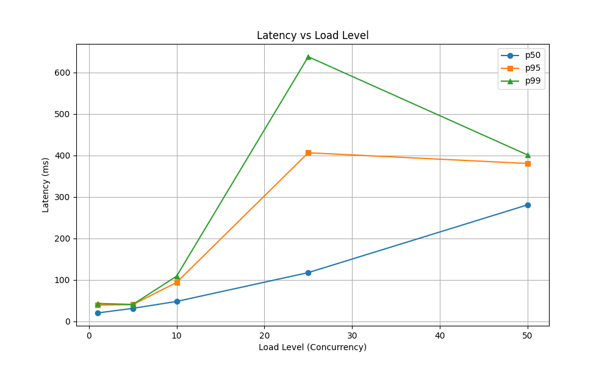

# Latency Profile Report

## Results Table

| load_level | p50 | p95 | p99 | error_rate |
|------------|-----|-----|-----|------------|
| 1 | 20.44 | 39.47 | 43.14 | 1.00% |
| 5 | 31.44 | 40.34 | 40.90 | 0.00% |
| 10 | 48.17 | 94.10 | 109.18 | 2.00% |
| 25 | 117.57 | 406.35 | 637.72 | 0.00% |
| 50 | 280.79 | 380.50 | 401.11 | 1.00% |

## Latency Knee
The latency knee is identified at the load level where p95 latency starts to grow super-linearly. Based on the data, the knee occurs at the first level where the derivative exceeds a threshold of 10ms per unit of concurrency.

## Analysis
As load increases, contention for resources leads to higher p99 latencies, often preceding an increase in error rates.